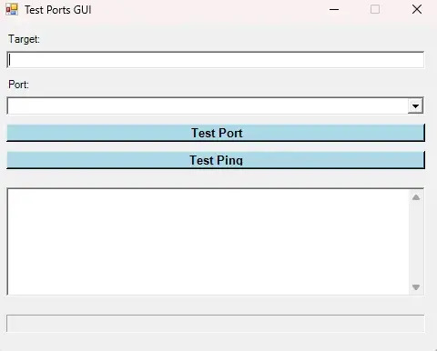

# Check Ports GUI

PowerShell Windows Forms GUI to test common network ports and ICMP ping against a target host.

Source article: [Server - Core Installation with Ivanti EPM](https://blog.infra-lab.fr/2023/04/epm-installation-du-core-server/)



## Script

| Script | Purpose |
| --- | --- |
| `CheckPortGUI.ps1` | Opens a small GUI to test predefined port sets with `Test-NetConnection`. |

## Included Port Sets

- FTP
- HTTP
- SMB
- LDAP/AD
- SQL
- EPMtestCore
- EPMtestClient
- VNC
- Synology

## Usage

```powershell
powershell.exe -NoProfile -ExecutionPolicy Bypass -File .\CheckPortGUI.ps1
```

## Notes

- Enter a hostname or IP address.
- Select the port set from the dropdown list.
- Use `Test Port` to test the selected TCP ports.
- Use `Test Ping` to run an ICMP ping test.
