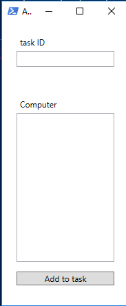
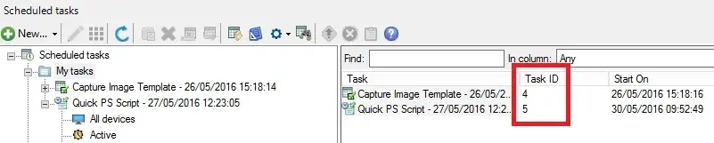

# Add Devices To EPM Scheduled Task

PowerShell WPF GUI to add one or more computers to an Ivanti EPM scheduled task through the MBSDK web service.

Source article: [API - GetMachineData or GetMachineDataEx with Ivanti EPM](https://blog.wuibaille.fr/2023/04/epm-getmachinedata-et-getmachinedataex/)

## Script

| Script | Purpose |
| --- | --- |
| `Add-ToScheduledTask.ps1` | Adds computer names to an existing scheduled task using `AddDeviceToScheduledTask`. |

## Usage

Run PowerShell in STA mode:

```powershell
powershell.exe -STA -NoProfile -ExecutionPolicy Bypass -File .\Add-ToScheduledTask.ps1 `
  -WebServiceUrl "https://epm.example.local/MBSDKService/MsgSDK.asmx"
```

The script prompts for credentials if `-Credential` is not provided.

## Screenshots





## Notes

- The scheduled task must already exist in Ivanti EPM.
- Enter one computer name per line.
- The source script used lab defaults for the credential and web service URL; those defaults were removed for publication.
