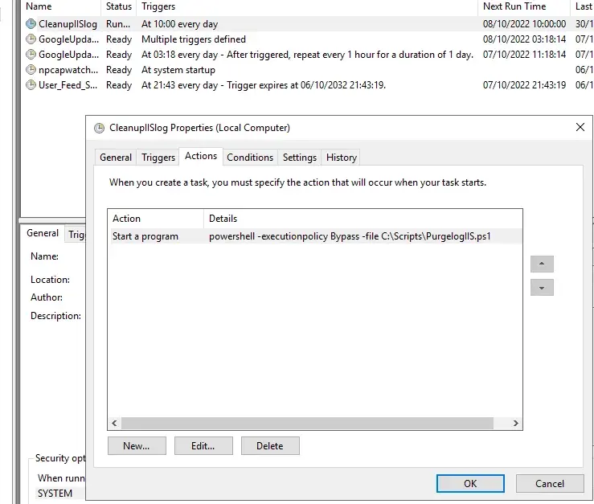

# Purge IIS Logs (PowerShell)

Purge old IIS log files to prevent the C: drive from filling up. IIS logs are stored by default under `%SystemDrive%\inetpub\logs\LogFiles`.


## Usage
Edit these variables :
```powershell
$LogPath
$maxDaystoKeep
$outputPath
```
Run from an elevated PowerShell prompt on the IIS server.

## Schedule (Task Scheduler)


Run weekly as SYSTEM (example: Sundays 02:00):
```powershell
schtasks /Create /TN "IIS Logs Purge" ^
  /TR "powershell.exe -NoProfile -ExecutionPolicy Bypass -File C:\Scripts\Purge-IISLogs.ps1" ^
  /SC WEEKLY /D SUN /ST 02:00 /RU SYSTEM /RL HIGHEST /F
```
