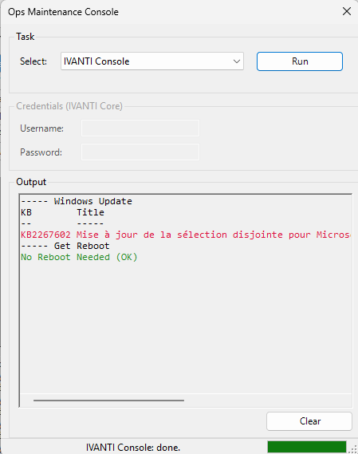

# Ivanti EPM Maintenance Console

PowerShell GUI used to run common maintenance tasks on Ivanti EPM, WSUS, and Windows servers from a single interface.

## Files

| File | Description |
| --- | --- |
| `ExploitBox.ps1` | Windows Forms maintenance console. |
| `main.cmd` | Example launcher for `ExploitBox.ps1`. |
| `SQLMaintenance2022.sql` | Ivanti EPM SQL maintenance script. |
| `WSUSMaintenance.sql` | WSUS database index/statistics maintenance script. |
| `readme.png` | Screenshot of the GUI. |

## Features

- Runs Ivanti EPM SQL maintenance from the GUI.
- Runs WSUS database maintenance against the local WID instance.
- Cleans old IIS logs on the server.
- Checks pending reboot status.
- Checks the Ivanti `ldscan` folder size.
- Can trigger Windows Update through the `PSWindowsUpdate` module.

## Configuration

Edit the Ivanti SQL settings at the top of `ExploitBox.ps1`:

```powershell
$script:IvantiSqlInstance = "serveurIVANTI.domain.lan"
$script:IvantiSqlDatabase = "LDMS123"
```

The SQL password is not stored in the script. It is entered in the GUI when the `IVANTI Core` task is selected.

## Requirements

- Run PowerShell as Administrator.
- Install the required PowerShell modules:

```powershell
Install-Module SqlServer -Scope CurrentUser -Force
Install-Module PSWindowsUpdate -Scope CurrentUser -Force -AllowClobber
```

- The account used for Ivanti SQL maintenance must have the required SQL permissions.
- WSUS maintenance expects a local Windows Internal Database instance at `\\.\pipe\MICROSOFT##WID\tsql\query`.

## Usage

Run:

```powershell
Unblock-File .\ExploitBox.ps1
powershell.exe -NoProfile -ExecutionPolicy Bypass -File .\ExploitBox.ps1
```

Or adapt `main.cmd` to the local path where the script is stored.



## Notes

- Review both SQL scripts before running them in production.
- Test each task manually in a lab before scheduling or using on a production core server.
- Replace the lab SQL instance and database names with your own environment values.
