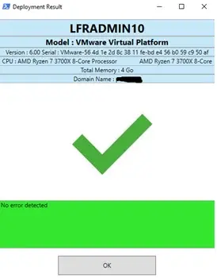
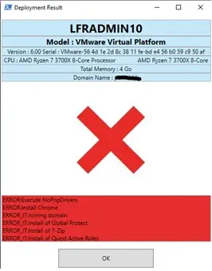
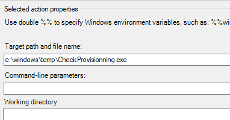

# Provisioning End Check

PowerShell GUI used at the end of an Ivanti EPM provisioning task to display deployment status, failed actions, hardware details, and missing driver indicators.

## Files

| File | Description |
| --- | --- |
| `CheckProvisionning.ps1` | PowerShell source script. |
| `CheckProvisionning.exe` | Compiled executable version. |
| `CheckProvisionning.ico` | Icon used by the executable. |
| `readme1.png` | Success example. |
| `readme2.png` | Failure example. |
| `readme3.png` | Provisioning action example. |

## Behavior

The tool:

1. Reads the Ivanti provisioning log from `C:\ldprovisioning\ProvisionGUI.exe.log` or `C:\exploit\log\ProvisionGUI.exe.log`.
2. Detects failed provisioning actions and non-zero return codes, excluding common allowed cases.
3. Displays computer name, IP address, model, serial number, CPU, and memory.
4. Checks for missing drivers or Microsoft fallback display drivers.
5. Shows a green or red status screen depending on the result.

## Usage

Add the tool as the last action in an Ivanti EPM provisioning template.

PowerShell version:

```cmd
powershell.exe -NoProfile -ExecutionPolicy Bypass -File .\CheckProvisionning.ps1
```

Executable version:

```cmd
CheckProvisionning.exe
```

## Screenshots







## Notes

- The tool is intended for end-of-task validation, not for automatic remediation.
- Actions containing `NoCheck` in the provisioning log are ignored by the failure summary.
- When VBoot is detected, the UI can auto-close depending on the log location.
