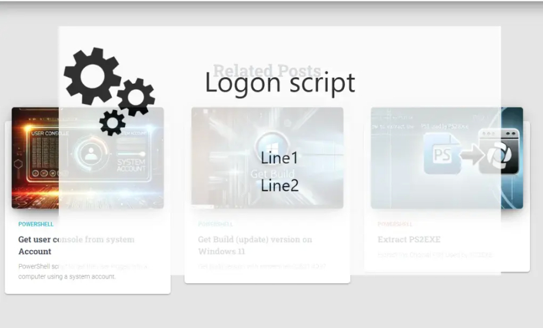

# ⏳ "Please Wait" Logon Popup (PowerShell + WPF)

A borderless, centered, always-on-top **WPF popup** to display during a logon script
or long-running task (e.g. *"Please wait, configuration in progress…"*). It shows a
logo, a title and up to three message lines, and can auto-close or reveal a **Close**
button after a delay.



## 🔧 What it does
- Displays a fullscreen-style, semi-transparent window that **stays on top** and
  cannot be closed by the user until allowed.
- Shows an embedded logo and up to **3 message lines**.
- Optionally **auto-closes** after a set number of seconds.
- Reveals a **Close** button only after a configurable delay.

## ⚙️ Parameters
| Parameter | Default | Description |
|---|---|---|
| `-ArgMes` | `"Line1\nLine2"` | Message text; use `` `n `` to split into lines (max 3) |
| `-ArgMesWindow` | `"Logon script"` | Window title / heading |
| `-ArgTime` | `0` | Auto-close after N seconds (`0` = never auto-close) |
| `-CloseTime` | `120` | Seconds before the **Close** button appears |

## ✅ Prerequisites
- Must run in **STA mode** (`powershell -sta`) — required for WPF.
- .NET Framework (PresentationFramework) available.

## 🚀 Usage
```powershell
powershell -sta -ExecutionPolicy Bypass -File .\PleaseWaitLogon.ps1 `
  -ArgMesWindow "Configuration" -ArgMes "Please wait`nInstallation in progress" -CloseTime 60
```

🔗 More details: **[Creating a Custom Logon Script Using PowerShell and WPF](https://blog.infra-lab.fr/2024/08/creating-a-custom-logon-script-using-powershell-and-wpf/)**
